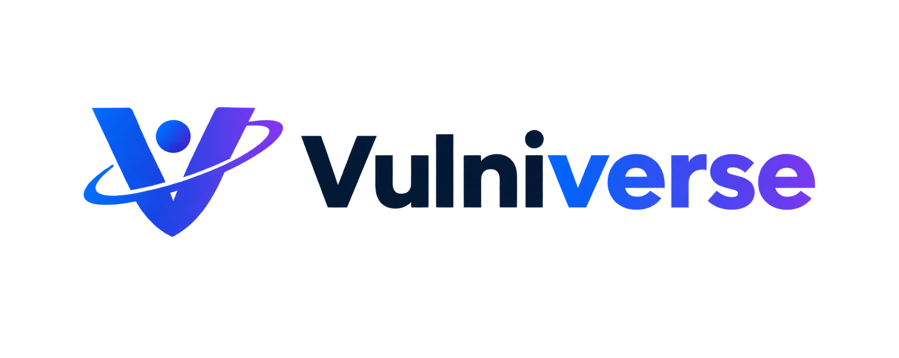
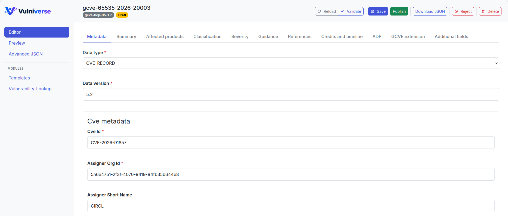

  

Vulniverse is a web-based editor for authoring, reviewing, validating, and
storing vulnerability records. It is intended as a modern replacement for
[Vulnogram](https://github.com/Vulnogram/Vulnogram), with integration as a
first-class goal: use the complete standalone application, embed the editor in
[Vulnerability-Lookup](https://github.com/vulnerability-lookup/vulnerability-lookup),
or connect it to any software that works with the CVE Record Format.

Vulniverse currently supports:

- CVE Record Format 5.2.0
- GCVE BCP-05 1.7
- Guided and schema-driven editing
- CVSS 2.0, 3.x and 4.0
- CVE/GCVE schema validation
- Draft records
- Embedding through a framework-independent Web Component
- Host-specific extensions through repositories, panels, and modules

> [!NOTE]
> Vulniverse is under active development. Public interfaces may change
> before the first stable release.

  

## Use Vulniverse

### Standalone

Run the Vue frontend together with the included Flask API for a complete
vulnerability-authoring application.

### Embedded

Build `<vulniverse-editor>` and integrate it into an existing application.
The host provides an `EditorRepository`, allowing Vulniverse to work with
the host application's existing API, storage, authentication and
authorization.

